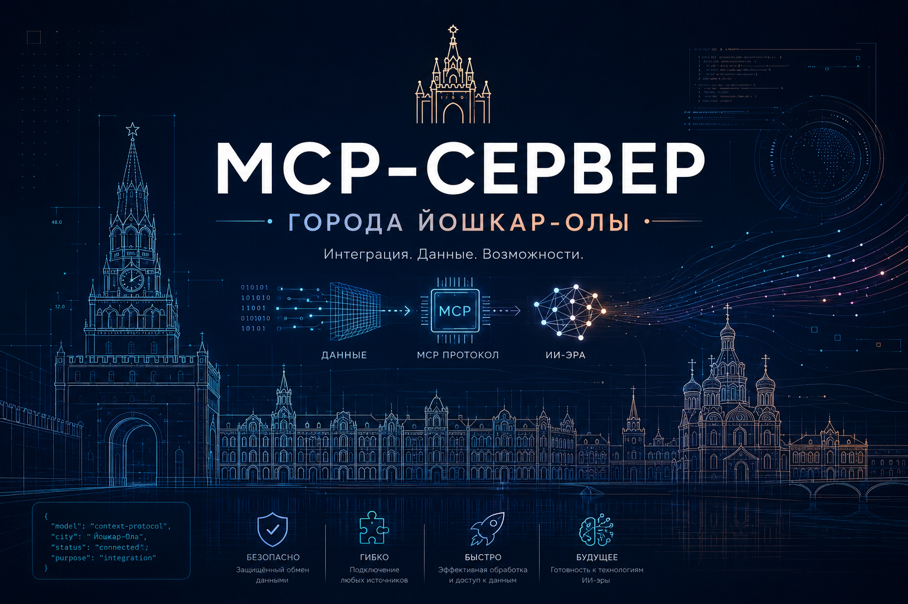

<p align="center">
  
</p>

# MCP-сервер открытых данных Йошкар-Олы

Публичный MCP-сервер для утвержденных открытых данных городского округа
"Город Йошкар-Ола".

Сервер предоставляет внешним AI-инструментам структурированный доступ к
утвержденным наборам данных городского округа "Город Йошкар-Ола". В первом
релизе доступны только открытые данные, подготовленные для внешнего
использования.

## Доступный endpoint

```text
https://apiiola.yasg.ru/mcp
```

Transport:

```text
streamable-http
```

Для локальных MCP-клиентов также доступен transport `stdio` через команду:

```text
yoshkar-ola-public-mcp-stdio
```

## Данные первого релиза

Сейчас через MCP-сервер доступны:

- муниципальные школы;
- муниципальные детские сады.

Источник данных для MCP:

```text
https://apiiola.yasg.ru/api/v1
```

## Источники сведений

Основной эталонный источник данных - "Цифровой мозг городского округа".
Данные в нем поддерживаются в актуальном состоянии за счет регулярных
автоматизированных обновлений из государственных информационных систем,
отраслевых информационных ресурсов и иных утвержденных источников.

## Возвращаемые поля

Для школ и детских садов возвращается только заранее утвержденный набор
публичных полей:

- `display_order` - порядковый номер для отображения;
- `inn` - ИНН;
- `legal_address` - юридический адрес;
- `address` - фактический/публичный адрес;
- `phone` - телефон;
- `email` - электронная почта;
- `website` - официальный сайт;
- `fns_kpp` - КПП по данным ФНС;
- `fns_ogrn` - ОГРН по данным ФНС;
- `fns_full_name` - полное наименование по данным ФНС;
- `fns_short_name` - сокращенное наименование по данным ФНС;
- `fns_entity_type` - тип юрлица;
- `fns_registration_date` - дата регистрации юрлица;
- `fns_region_name` - регион по данным ФНС;
- `fns_status` - статус юрлица;
- `fns_address` - юридический адрес по данным ФНС;
- `fns_head_position` - должность руководителя по данным ФНС;
- `fns_head_name` - ФИО руководителя по данным ФНС;
- `license_number` - номер образовательной лицензии;
- `license_date` - дата лицензии/последнего изменения;
- `license_order` - приказ/основание лицензии;
- `license_term` - срок действия;
- `license_status` - статус лицензии;
- `license_issuing_organ` - орган, выдавший лицензию.

## MCP-инструменты

### `list_schools`

Возвращает список школ.

Параметры:

- `limit` - сколько записей вернуть, по умолчанию `100`, максимум `200`;
- `offset` - смещение, по умолчанию `0`.

Пример запроса:

```text
Покажи список муниципальных школ Йошкар-Олы.
```

### `search_schools`

Ищет школы по названию, ИНН, адресу, руководителю, email или сайту.

Параметры:

- `query` - строка поиска;
- `limit` - максимум результатов, по умолчанию `20`.

Примеры:

```text
Найди школу № 29.
```

```text
Какая школа находится на улице Петрова?
```

### `get_school_by_inn`

Возвращает одну школу по ИНН.

Параметры:

- `inn` - ИНН организации.

### `list_kindergartens`

Возвращает список детских садов.

Параметры:

- `limit` - сколько записей вернуть, по умолчанию `100`, максимум `200`;
- `offset` - смещение, по умолчанию `0`.

### `search_kindergartens`

Ищет детские сады по названию, ИНН, адресу, руководителю, email или сайту.

Параметры:

- `query` - строка поиска;
- `limit` - максимум результатов, по умолчанию `20`.

### `get_kindergarten_by_inn`

Возвращает один детский сад по ИНН.

Параметры:

- `inn` - ИНН организации.

### `get_data_update_info`

Возвращает дату последнего обновления открытых данных.

Пример запроса:

```text
Когда последний раз обновлялись данные?
```

## Подключение в MCP-клиенте

Если клиент поддерживает remote MCP / streamable HTTP, укажите:

```text
https://apiiola.yasg.ru/mcp
```

Авторизация на первом этапе не требуется, потому что сервер отдает только
открытые публичные данные.

Если клиент работает только с локальными MCP-серверами, используйте `stdio`
entrypoint после установки пакета:

```text
yoshkar-ola-public-mcp-stdio
```

##  Подключение в ChatGPT / OpenAI

Для ChatGPT и OpenAI API есть три рабочих сценария.

### ChatGPT Apps / custom MCP app

В ChatGPT Web сервер подключается как remote MCP app. Используйте публичный
endpoint:

```text
https://apiiola.yasg.ru/mcp
```

Локальный `stdio` transport для ChatGPT напрямую не подходит: ChatGPT
подключается к удаленным MCP-серверам. Если сервер находится в приватной сети
или на машине разработчика, используйте совместимый tunnel/remote gateway.

### Custom GPT через Actions

Для GPT Actions можно подключить не MCP endpoint, а обычный публичный REST API.
Готовая OpenAPI-схема находится здесь:

```text
docs/openapi/chatgpt-actions.openapi.yaml
```

В GPT editor откройте `Actions`, создайте новое action и вставьте эту схему.
Авторизация для первого релиза не требуется.

Важно: в настройках одного Custom GPT используется либо `Apps`, либо
`Actions`. Если нужен именно MCP, выбирайте custom MCP app; если нужен простой
REST-доступ к первым слоям, выбирайте GPT Actions.

### OpenAI Responses API

В OpenAI API remote MCP подключается как инструмент `mcp`:

```json
{
  "type": "mcp",
  "server_label": "yoshkar_ola_public_data",
  "server_description": "Открытые данные городского округа \"Город Йошкар-Ола\".",
  "server_url": "https://apiiola.yasg.ru/mcp",
  "require_approval": "never"
}
```

Официальная документация OpenAI:

- https://help.openai.com/en/articles/11487775-connectors-in-chatgpt
- https://help.openai.com/en/articles/12584461-developer-mode-apps-and-full-mcp-connectors-in-chatgpt-beta.svgz
- https://developers.openai.com/api/docs/guides/tools-connectors-mcp
- https://help.openai.com/en/articles/9442513-configuring-actions-in-gpts

##  Подключение в Codex

Команды ниже соответствуют локальной справке Codex CLI `codex mcp add --help`:
для удаленного streamable HTTP-сервера используется `--url`, для локального
`stdio`-сервера команда указывается после `--`.

Remote MCP:

```bash
codex mcp add yoshkarOlaPublicData --url https://apiiola.yasg.ru/mcp
codex mcp list
```

Локальный stdio MCP:

```bash
python -m pip install -e .
codex mcp add yoshkarOlaPublicDataLocal -- yoshkar-ola-public-mcp-stdio
codex mcp list
```

Skill для Codex находится в каталоге:

```text
skills/yoshkar-ola-open-data/SKILL.md
```

Чтобы использовать его локально, скопируйте каталог skill в директорию skills
вашего Codex-профиля. Пример для PowerShell:

```powershell
$skills = "$env:USERPROFILE\.codex\skills"
New-Item -ItemType Directory -Force -Path $skills
Copy-Item -Recurse -Force .\skills\yoshkar-ola-open-data "$skills\yoshkar-ola-open-data"
```

##  Подключение в Claude

Для Claude.ai, Claude Desktop и Claude Code используйте один из двух вариантов,
если он доступен в вашей версии клиента:

- remote connector / custom connector:

```text
https://apiiola.yasg.ru/mcp
```

- локальный MCP через `stdio` в конфигурации Claude Desktop:

```json
{
  "mcpServers": {
    "yoshkarOlaPublicData": {
      "command": "yoshkar-ola-public-mcp-stdio"
    }
  }
}
```

Skill-инструкцию из `skills/yoshkar-ola-open-data/SKILL.md` можно добавить в
Claude Project instructions, Claude Skills или другой механизм проектных
инструкций, если он доступен в используемом клиенте.

Официальная документация Anthropic по MCP:

- https://docs.anthropic.com/en/docs/mcp
- https://docs.anthropic.com/en/docs/claude-code/mcp
- https://docs.anthropic.com/en/docs/agents-and-tools/mcp-connector

##  Подключение в GigaChat

Для GigaChat-сценариев используйте MCP через агентный слой, например
GigaChain/LangChain MCP adapters:

- для локального запуска используйте команду `yoshkar-ola-public-mcp-stdio`;
- для удаленного запуска используйте публичный endpoint
  `https://apiiola.yasg.ru/mcp`, если выбранный MCP-клиентский слой
  поддерживает streamable HTTP;
- если конкретная интеграция ожидает SSE, используйте совместимый MCP gateway
  или proxy между клиентом и этим сервером.

Skill-инструкцию используйте как system prompt / instructions для агента.

Официальный пример Sber/GigaChain:

- https://developers.sber.ru/docs/ru/gigachain/tutorials/agent-gigachat-mcp

##  Подключение в Yandex AI Studio / YandexGPT

В Yandex AI Studio можно подключать MCP-серверы через MCP Hub. Для внешнего
MCP-сервера используйте endpoint:

```text
https://apiiola.yasg.ru/mcp
```

Если сценарий строится не через MCP Hub, а через function calling, реализуйте
тонкий слой функций, который вызывает инструменты этого MCP-сервера и
возвращает результат модели. Skill-инструкцию из
`skills/yoshkar-ola-open-data/SKILL.md` используйте как системную инструкцию
агента.

Официальная документация Yandex Cloud:

- https://yandex.cloud/ru/docs/ai-studio/concepts/mcp-hub/

## Локальный запуск

Установить зависимости:

```bash
python -m venv .venv
.venv/bin/pip install -e ".[dev]"
```

Запустить сервер:

```bash
MCP_HOST=127.0.0.1 MCP_PORT=8001 MCP_PATH=/mcp .venv/bin/yoshkar-ola-public-mcp
```

На Windows PowerShell:

```powershell
python -m venv .venv
.\.venv\Scripts\pip.exe install -e ".[dev]"
$env:MCP_HOST = "127.0.0.1"
$env:MCP_PORT = "8001"
$env:MCP_PATH = "/mcp"
.\.venv\Scripts\yoshkar-ola-public-mcp.exe
```

Запустить локальный stdio transport:

```bash
.venv/bin/yoshkar-ola-public-mcp-stdio
```

На Windows PowerShell:

```powershell
.\.venv\Scripts\yoshkar-ola-public-mcp-stdio.exe
```

## Переменные окружения

- `CPR_PUBLIC_API_BASE_URL` - базовый URL публичного API, по умолчанию `https://apiiola.yasg.ru/api/v1`;
- `CPR_PUBLIC_API_TIMEOUT` - timeout HTTP-запросов к API в секундах, по умолчанию `20`;
- `CPR_PUBLIC_API_CACHE_TTL` - TTL кэша в секундах, по умолчанию `300`;
- `MCP_HOST` - host MCP-сервера, по умолчанию `127.0.0.1`;
- `MCP_PORT` - port MCP-сервера, по умолчанию `8001`;
- `MCP_PATH` - путь MCP endpoint, по умолчанию `/mcp`.

См. также `.env.example`.

## Безопасность

Сервер предназначен только для получения утвержденных открытых данных.
Если вы обнаружили неточность в данных или считаете, что какая-либо
информация не должна быть опубликована, сообщите об этом сопровождающим
проекта приватным каналом.

## Ограничения

Этот MCP-сервер не является полным реестром всех данных ЦПР. Он предоставляет
только те наборы и поля, которые явно добавлены в код и одобрены для
открытого доступа.

## Деплой

Пример шаблона systemd-сервиса и nginx-location находится в каталоге
`deploy/`. Конкретные параметры боевого окружения задаются на стороне
инфраструктуры.
